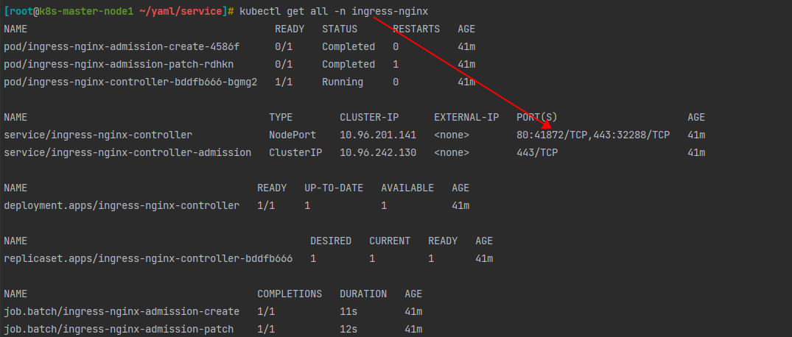
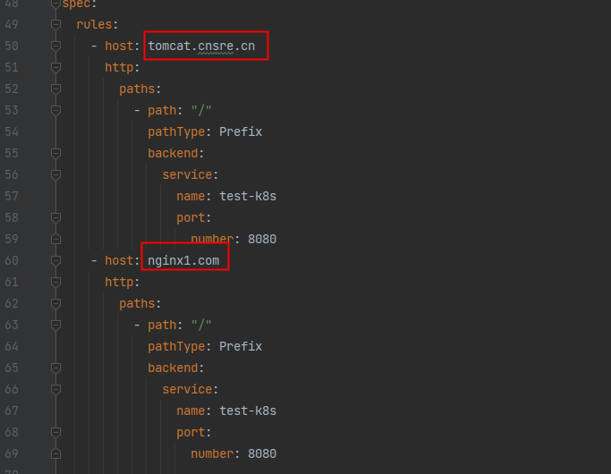
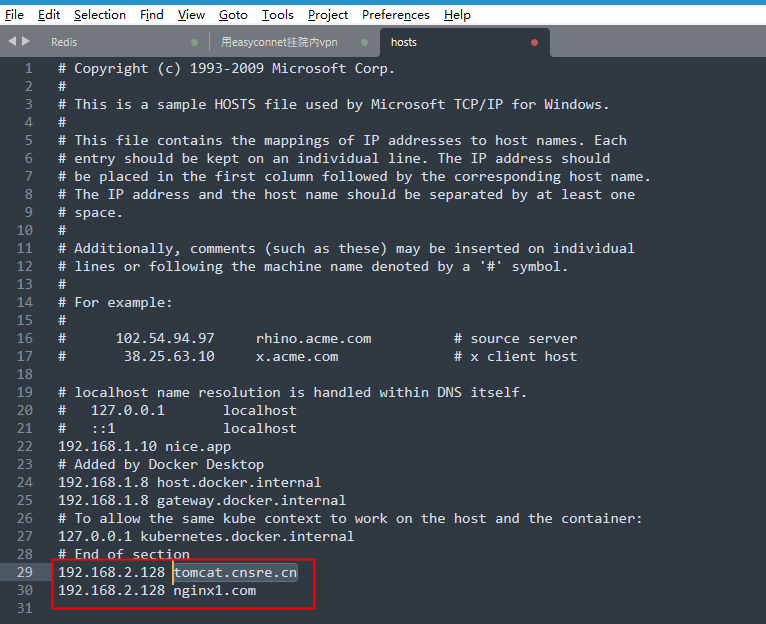
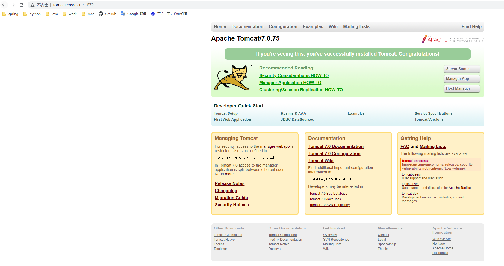

# 0. Node not ready 

kubectl apply -f https://raw.githubusercontent.com/coreos/flannel/master/Documentation/kube-flannel.yml

# 1. 部署 ingress 

```shell
# 启用 ingress
minikube addons enable ingress
# 禁用 ingress
minikube addons disable ingress

# 或者部署 yaml/service/ingress-deploy.yaml ingress
kubectl apply -f ingress-deploy.yaml
```

# 2. 通过 ingress 访问服务

部署服务
    
    kubectl apply -f app.yaml

查看 ingress 服务

    kubectl get ingress

```shell
# 端口
kubectl get all -n ingress-nginx    

# minikube 需要添加一下配置
# 本地监听端口:8000
# 容器端口:80
kubectl port-forward service/ingress-nginx-controller 8000:80 -n ingress-nginx

# tomcat.cnsre.cn:8000 即可访问成功
curl 'Host:tomcat.cnsre.cn:8000' 127.0.0.1:8000

# 或者在 k8s 容器中执行一下命令,ip 为 pod/ingress-nginx-controller IP 地址
echo "10.96.180.95 tomcat.cnsre.cn" >> /etc/hosts
echo "10.96.180.95 nginx1.com" >> /etc/hosts
echo "10.96.180.95 tomcat.cnsre.cn,nginx1.com" >> /etc/hosts

curl nginx1.com
```

# 3. 查看服务

查看 service/ingress-nginx-controller 端口,配置域名，通过 kubectl get all -n ingress-nginx 端口访问








