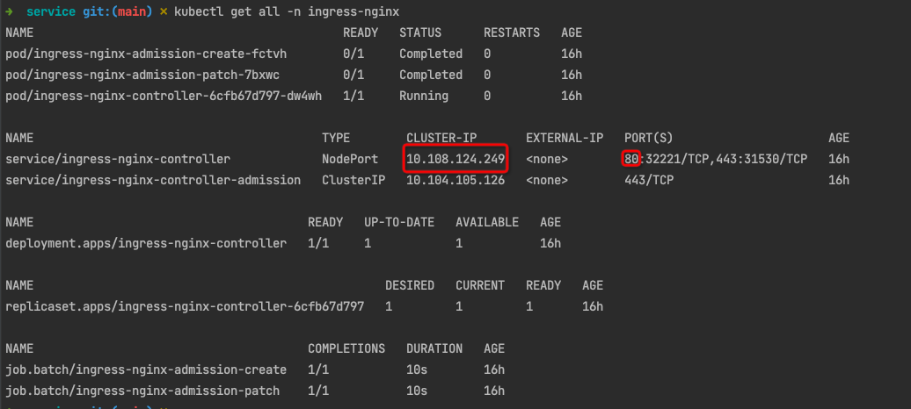
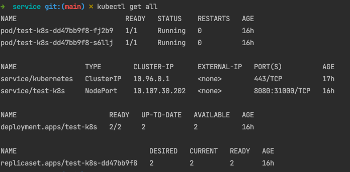
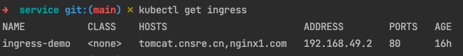
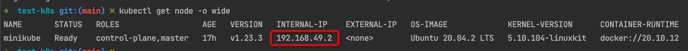
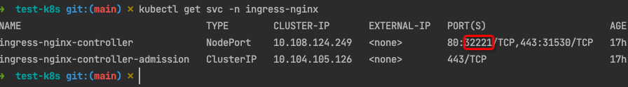
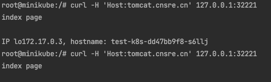
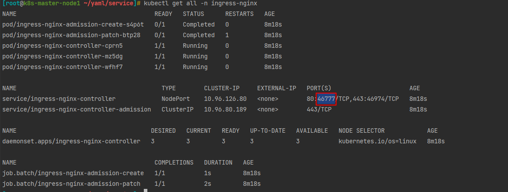
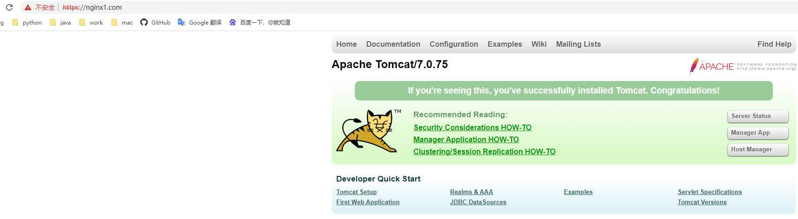
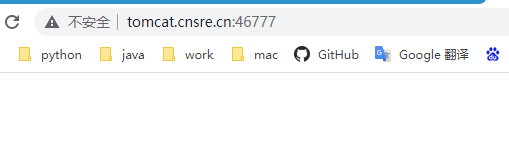

# 1. 安装 K8S

自动化部署脚本 https://github.com/lework/kainstall

## 1.1 yum 源中可能找不到 sshpass ,手动安装

```xshell
wget https://nchc.dl.sourceforge.net/project/sshpass/sshpass/1.06/sshpass-1.06.tar.gz

tar zxf sshpass-1.06.tar.gz

cd sshpass-1.06

./configure --prefix=/usr/local/

make && make install
```

## 1.2 安装 k8s

```shell
# 下载脚本
wget https://cdn.jsdelivr.net/gh/lework/kainstall@master/kainstall-centos.sh

# Node not ready,下载不下来需要手动下载 yaml 文件
kubectl apply -f https://raw.githubusercontent.com/coreos/flannel/master/Documentation/kube-flannel.yml
```

## 1.3 关于 service

service type 设置 NodePort

```shell
# kubectl get svc,可通过 nodeIp:nodePort 端口访问服务


```

# 2 部署 ingress

## 2.1 安装 ingress

依照 k8s 脚本安装合适的 ingress nginx 脚本

https://github.com/kubernetes/ingress-nginx/tree/main/deploy/static/provider/baremetal

国外源下载不下来，https://cr.console.aliyun.com/cn-hangzhou/instances/images?accounttraceid=77f6797a00534741a43f440f46eeb106tkhk
替换镜像源

## 2.2 minikube 安装方式

```shell
# 启用 ingress
minikube addons enable ingress
# 禁用 ingress
minikube addons disable ingress
```

## 2.3 手动搭建

```shell
# 或者部署 yaml/service/ingress-deploy.yaml ingress
kubectl apply -f /yaml/service/ingress-deploy.yaml

# 查看 ingress-nginx 资源
kubectl get all -n ingress-nginx

```



## 2.4 通过 ingress 访问服务

```shell
# mac 启动
kubectl apply -f /yaml/service/app.yaml

# linux or windows 启动
kubectl apply -f /yaml/service/tomcat-service.yaml
```

查看服务



查看 ingress

    kubectl get ingress



# 2.5 minikube 访问

```shell
# 转发 service/ingress-nginx-controller -n ingress-nginx 端口
# 8000: 本机端口
# 80: 容器端口
kubectl port-forward service/ingress-nginx-controller 8000:80 -n ingress-nginx

# 配置 hosts 文件,生产上配置节点机器即可
127.0.0.1 tomcat.cnsre.cn
127.0.0.1 nginx1.com

# 命令访问
curl -H 'Host:tomcat.cnsre.cn' 127.0.0.1:8000
curl -H 'Host:nginx1.com' 127.0.0.1:8000
```

## 2.6 生产访问

配置 hosts,生产为任意节点的 IP 地址



```shell
echo "192.168.49.2 tomcat.cnsre.cn" >> /etc/hosts
echo "192.168.49.2 nginx1.com" >> /etc/hosts
```

请求服务，获取端口配置，32221 端口随机，后续优化

kubectl get svc -n ingress-nginx



```shell
curl -H 'Host:tomcat.cnsre.cn' 127.0.0.1:32221
curl -H 'Host:nginx1.com' 127.0.0.1:32221
```



ps: 生产域名绑定，就不用做映射了

# 3. 配置域名访问

修改 /ingress/ingress-deploy.yaml ingress-nginx-controller

```yaml
apiVersion: apps/v1
#kind: Deployment
# 把 kind: Deployment 改为 kind: DaemonSet 模式，这样每台 node 上都有 ingress-nginx-controller pod 副本
kind: DaemonSet
metadata:
  labels:
    app.kubernetes.io/component: controller
    app.kubernetes.io/instance: ingress-nginx
    app.kubernetes.io/name: ingress-nginx
    app.kubernetes.io/part-of: ingress-nginx
    app.kubernetes.io/version: 1.2.0
  name: ingress-nginx-controller
  namespace: ingress-nginx
spec:
  template:
  spec:
    hostNetwork: true # 新增 
    containers:
```

重新部署

```shell
kubectl apply -f deploy.yaml
kubectl get pods -n ingress-nginx -o wide
# yum install yum install net-tools
netstat -pntl | grep 443
netstat -pntl | grep 80
```

## 3.1 生成证书

ingress-nginx 配置 HTTPS 访问

```shell
#创建自签证书文件
openssl req -x509 -nodes -newkey rsa:2048 -keyout tls.key -out tls.crt -subj "/CN=nginx/O=nginx"

#创建后会生成两个文件
tls.crt tls.key

#创建 secret
kubectl create secret tls tls-secret --key tls.key --cert tls.crt

#查看
kubectl get secret
```

修改 tomcat-ingress yaml

```yaml
apiVersion: networking.k8s.io/v1
kind: Ingress
metadata:
  name: ingress-demo
  annotations:
    kubernetes.io/ingress.class: "nginx"
spec:
  # 新增
  tls:
    - hosts:
        - tomcat.cnsre.cn
      secretName: tls-secret
    - hosts:
        - nginx1.com
        secretName: tls-secret
  rules:
    - host: tomcat.cnsre.cn
      http:
        paths:
          - path: "/"
            pathType: Prefix
            backend:
              service:
                name: tomcat-service-yaml
                port:
                  number: 8080
    - host: nginx1.com
      http:
        paths:
          - path: "/"
            pathType: Prefix
            backend:
              service:
                name: tomcat-service-yaml
                port:
                  number: 8080
```

访问

    https://tomcat.cnsre.cn 或者 tomcat.cnsre.cn:46777







# 4. 查看服务

查看 service/ingress-nginx-controller 端口,配置域名，通过 kubectl get all -n ingress-nginx 端口访问


