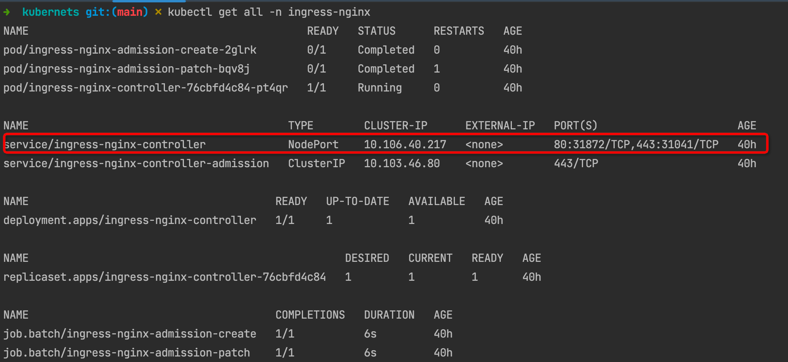
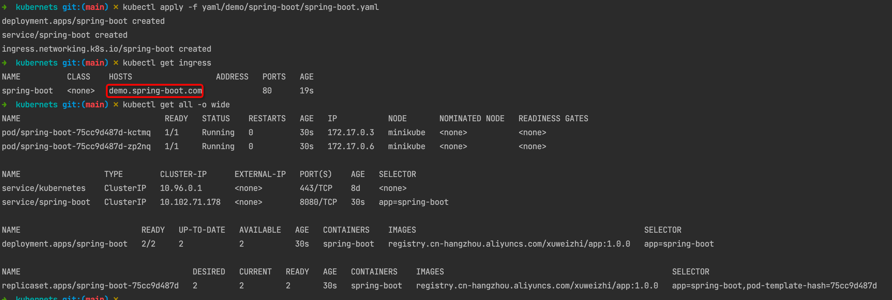
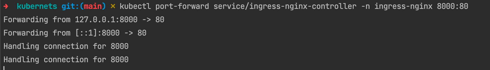
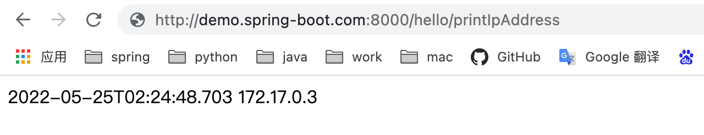
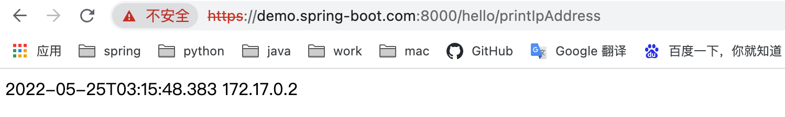
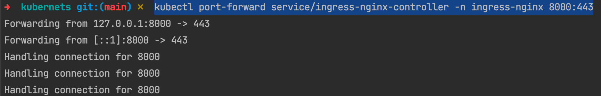
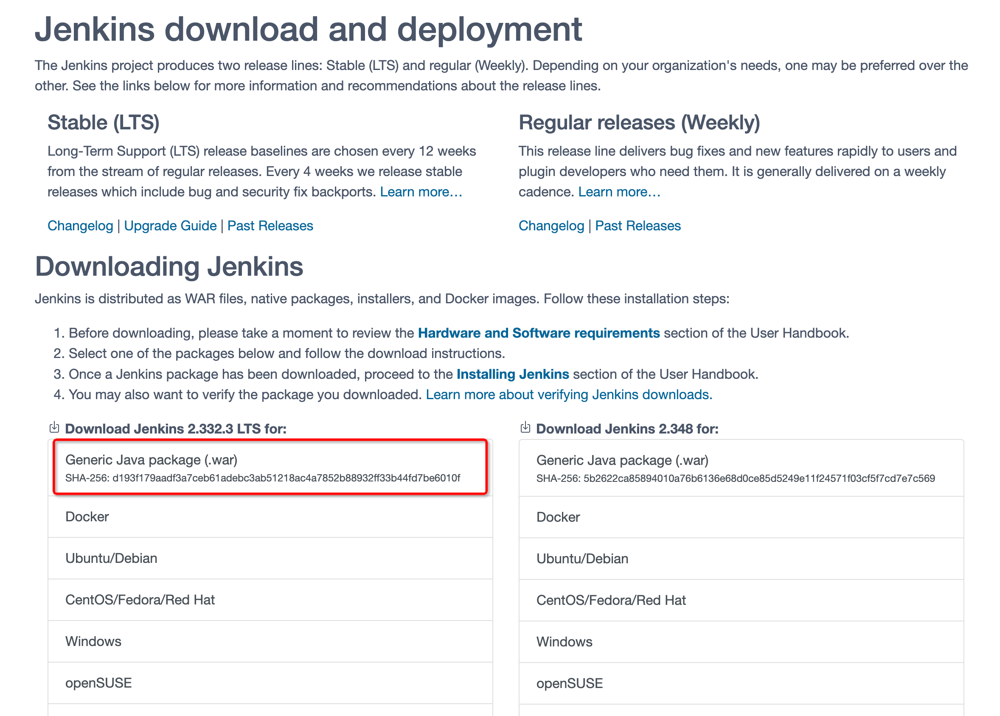
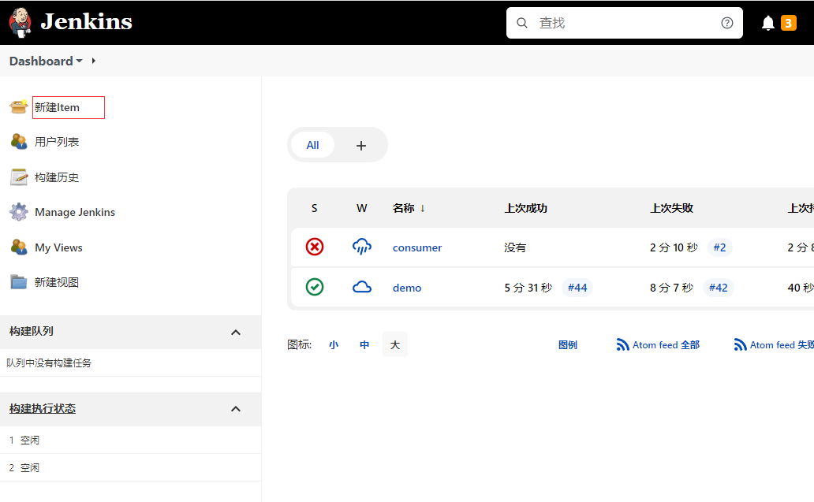
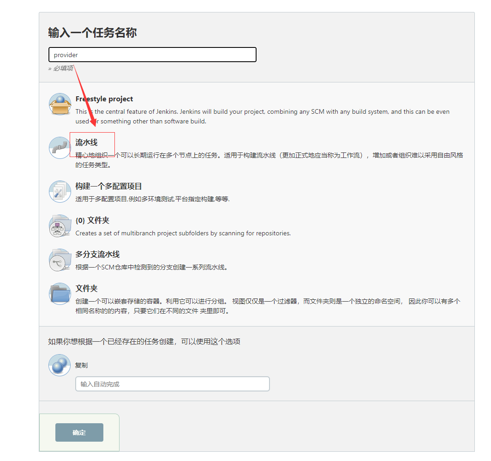
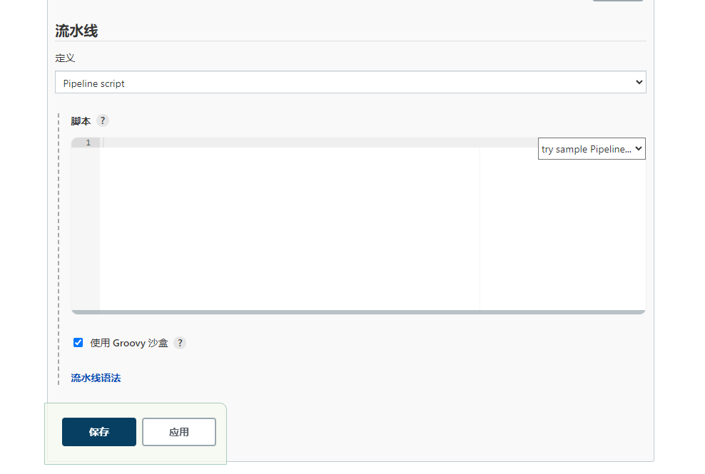

# 1 minikube

安装非常简单，支持各种平台，[安装方法](https://minikube.sigs.k8s.io/docs/start/)

需要提前安装好 Docker, docker 内存配置 6 - 8 G,不然资源可能不够

```shell
#解决 minikube start 过程中拉取镜像慢的问题
#先执行
minikube delete
#再执行，下载镜像比较慢
minikube start --image-mirror-country='cn'
# 启动集群
minikube start
# 查看节点。kubectl 是一个用来跟 K8S 集群进行交互的命令行工具
kubectl get node
# 停止集群
minikube stop
# 清空集群
minikube delete --all
# 安装集群可视化 Web UI 控制台
minikube dashboard
```

## 1.2 安装 ingress-nginx

### 1.2.1 无证书 ingress-nginx http 访问

无证书 ingress 部署，通过 service ingress-nginx-controller-ip:nodePort 访问 http://demo.ingress-nginx.com:nodePort 访问 

- demo.ingress-nginx.com: 本地 host 添加域名映射
- minikube: 由于是 docker 模拟 node 节点，因此需要端口转发
  - kubectl port-forward service/ingress-nginx-controller  -n ingress-nginx 8000:80
  - 8000: 宿主机端口
  - 80: ingress-nginx 端口

```shell
# 部署 ingress 资源
kubectl apply -f yaml/demo/service/ingress-deploy.yaml

# 查看 ingress-nginx 资源
kubectl get all -n ingress-nginx
```



启动 yaml/demo/service/tomcat-service.yaml,创建 pod 、service、ingress

```shell
kubectl apply -f yaml/demo/spring-boot/spring-boot.yaml
```



转发端口就可以访问 http://demo.spring-boot.com:8000/hello/printIpAddress

```shell
# minikube 中要转发端口
kubectl port-forward service/ingress-nginx-controller -n ingress-nginx 8000:80
# k8s 真实环境,k8s 任意 node 节点宿主机 ip:nodePort 端口就可访问，集群内可以通过 service/ingress-nginx-controller ip:nodePort 端口访问
kubectl get pods -o wide
```
以下是 minikube 方式访问，端口转发和 host 映射





### 1.2.1 有证书 ingress-nginx 

minikube 直接安装 ingress-nginx

```shell
# 删除原来的 ingres-nginx,删除 ingress-nginx 验证时间比较长，需要耐心等待 2-5 分钟左右
kubectl delete -f yaml/demo/service/ingress-deploy.yaml
# 启用 ingress
minikube addons enable ingress
# 禁用 ingress
minikube addons disable ingress
# 重启 minikube
minikube stop
minikube start --image-mirror-country='cn'
```

真实环境（minikube 不能以下的方式重新部署 ingress-nginx）

```shell
# 删除原来的 ingres-nginx,删除 ingress-nginx 验证时间比较长，需要耐心等待 2-5 分钟左右
kubectl delete -f yaml/demo/service/ingress-deploy.yaml
# ingress-nginx 命名空间终止后才重新部署 ingress-nginx
kubectl get ns

# 部署通过证书访问的 ingress-nginx,桥接变为宿主机模式和每个节点都有部署 ingress-nginx-controller
kubectl apply -f yaml/system/ingress/ingress-deploy.yaml
```
minikube 不能以下的方式重新部署 ingress-nginx 会遇到一下问题

```shell
➜  kubernets git:(main) ✗    kubectl apply -f yaml/demo/spring-boot/spring-boot.yaml
deployment.apps/spring-boot created
service/spring-boot created
Error from server (InternalError): error when creating "yaml/demo/spring-boot/spring-boot.yaml": Internal error occurred: failed calling webhook "validate.nginx.ingress.kubernetes.io": failed to call webhook: Post "https://ingress-nginx-controller-admission.ingress-nginx.svc:443/networking/v1/ingresses?timeout=10s": x509: certificate is valid for minikubeCA, control-plane.minikube.internal, kubernetes.default.svc.cluster.local, kubernetes.default.svc, kubernetes.default, kubernetes, localhost, not ingress-nginx-controller-admission.ingress-nginx.svc
```

### 1.2.1.1 创建证书并存储到 secret 中

```shell
#创建自签证书文件
openssl req -x509 -nodes -newkey rsa:2048 -keyout tls.key -out tls.crt -subj "/CN=nginx/O=nginx"

#创建后会生成两个文件
tls.crt tls.key

#创建 secret
kubectl create secret tls tls-secret --key tls.key --cert tls.crt

#查看
kubectl get secret
```

### 1.2.1.2 重启服务

yaml/demo/spring-boot/spring-boot.yaml ingress 添加证书

```shell
# ingress
spec:
  # 新增
  tls:
    - hosts:
        - demo.spring-boot.com
      secretName: tls-secret
```

重启服务

```shell
# 部署服务
kubectl apply -f yaml/demo/spring-boot/spring-boot.yaml
# 转发 ingress-nginx 443 端口，80 端口转发有问题
kubectl port-forward service/ingress-nginx-controller -n ingress-nginx 8000:443
```



# 2. 安装 jenkins

[官网](https://www.jenkins.io/download/)下载可执行 war 包,可选择 yum、docker、K8S 部署

```shell
# 后台启动
nohup java -jar jenkins.war --httpPort=10000 >> ./app.log 2>&1 &
# 输入 localhost:10000 登录页面,查看 app.log秘钥 (倒数几行)
cat app.log 
```





ps: 本地有 docker、jdk、mvn、kubetcl 环境

# 2.1 创建一个 Job 流水线

新建 item



选择流水线



需要注意的点,以下的参数要随之修改：

- WORK_SPACE: demo 改为相应的 item name
- JAR_NAME: 不用换修改
- MODULE: 打包的模块路径必须修改
- EXPOSE_PORT: 暴露端口与服务端口一直即可
- HOST: 目前服务通过暴露域名的方式启动
    - PATH: 待实现
    - ENABLE_INGRESS: 配套使用
- settings.xml: 找我要

复制下面的编排脚本到流水线中



### linux or mac

docker 镜像仓库需要登录

需要修改的点

- WORK_SPACE: jenkins 工作目录
- BUILD_DIR: docker 构建镜像目录
- MAVEN_CONFIG_PATH: maven 配置文件目录，我项目
- stage('mvn install'): 具体的打包命令，根据项目来更改
- stage('docker build') 和  stage('kubernetes deploy') 脚本路径要修改
```
node {
    
    def mvnHome
    
    // jenkins 目录地址，必须机器的地址配置
    env.WORK_SPACE='/root/.jenkins/workspace/demo'
    // 打包后的 jar 名称，不相同需要设置，并修改 Dockerfile 的 copy 名称 
    env.JAR_NAME="app-1.0.0.jar"
    // ingress 监听的域名
    env.HOST="tomcat.cnsre.cn"
    // 容器暴露端口
    env.EXPOSE_PORT="8080";
    // docker build 基础路径
    env.BUILD_DIR='/opt/build-workspace'
    // 项目中模块的地址
    env.MODULE="java/interview"
    // xml 配置
    env.MAVEN_CONFIG_PATH="/opt/config/settings.xml"
    // docker 镜像仓库地址
    env.DOCKER_REGISTER_URL="registry.cn-hangzhou.aliyuncs.com/xuweizhi"
    // 是否开启 ingress
    env.ENABLE_INGRESS="true"
    // 下载项目
    stage('download project') {
        // 项目配置地址
        git 'https://gitee.com/xuweizhi/summary.git'
    }
    
    // mvn 打包
    stage('mvn install') {
        // 配置 zsh 必须执行该命令
        sh 'source ~/.bash_profile'
        // dubbo 模块需要打包父模块,需要手动更改
        sh 'mvn clean install -pl ${MODULE} -amd -s ${MAVEN_CONFIG_PATH} -Dmaven.test.skip=true -P rdc'
    }
    
    // 制作镜像并上传
    stage('docker build') {
        // 此处要登录一下 docker login 仓库否则 push 失败
        sh 'bash /opt/config/docker.sh'
    }
    
    // 不需要 ingress 要注释一下模板，位于 /op/build-workspace/kubernetes-demo/yaml/spring-boot.yaml
    stage('kubernetes deploy') {
        sh 'bash /opt/config/deploy.sh'
    }

}
```

mac
```shell
 node {
    
    def mvnHome
    
    // jenkins 目录地址，必须机器的地址配置
    env.WORK_SPACE='/Users/xuweizhi/.jenkins/workspace/demo'
    // 打包后的 jar 名称，不相同需要设置，并修改 Dockerfile 的 copy 名称 
    env.JAR_NAME="app-1.0.0.jar"
    // ingress 监听的域名
    env.HOST="tomcat.cnsre.cn"
    // 容器暴露端口
    env.EXPOSE_PORT="8080";
    // docker build 基础路径
    env.BUILD_DIR='/Users/xuweizhi/Documents/build-workspace'
    // 项目中模块的地址
    env.MODULE="java/interview"
    // xml 配置
    env.MAVEN_CONFIG_PATH="/Users/xuweizhi/.m2/settings2.xml"
    // docker 镜像仓库地址
    env.DOCKER_REGISTER_URL="registry.cn-hangzhou.aliyuncs.com/xuweizhi"
    // 是否开启 ingress
    env.ENABLE_INGRESS="true"
    // 下载项目
    stage('download project') {
        // 项目配置地址
        git 'https://gitee.com/xuweizhi/summary.git'
    }
    
    // mvn 打包
    stage('mvn install') {
        // 配置 zsh 必须执行该命令
        sh 'source ~/.bash_profile'
        // dubbo 模块需要打包父模块,需要手动更改
        sh 'mvn clean install -pl ${MODULE} -amd -s ${MAVEN_CONFIG_PATH} -Dmaven.test.skip=true -P rdc'
    }
    
    // 制作镜像并上传
    stage('docker build') {
        // 此处要登录一下 docker login 仓库否则 push 失败
        sh 'bash /Users/xuweizhi/Documents/root/kubernets/yaml/jenkins/docker.sh'
    }
    
    // 不需要 ingress 要注释一下模板，位于 /op/build-workspace/kubernetes-demo/yaml/spring-boot.yaml
    stage('kubernetes deploy') {
        sh 'bash /Users/xuweizhi/Documents/root/kubernets/yaml/jenkins/deploy.sh'
    }

}

```
