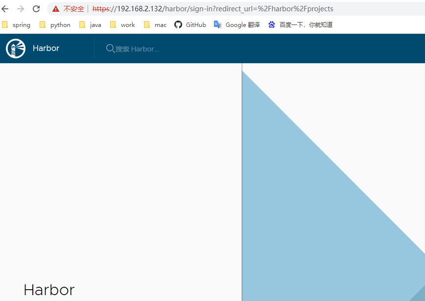
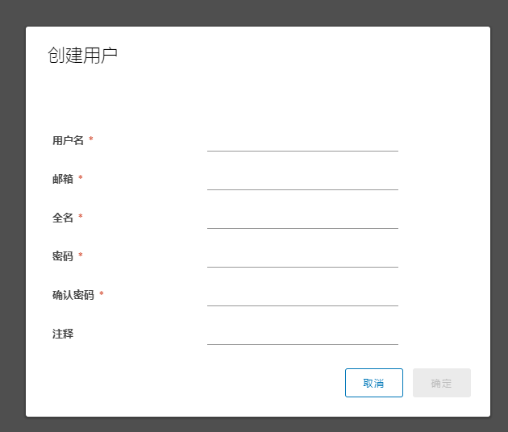
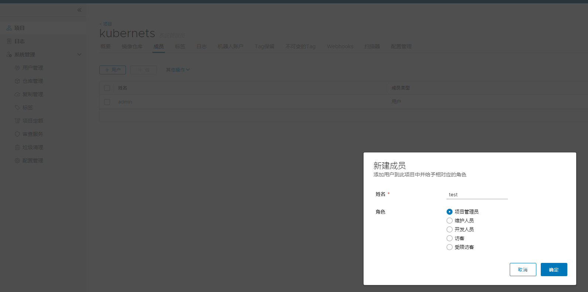
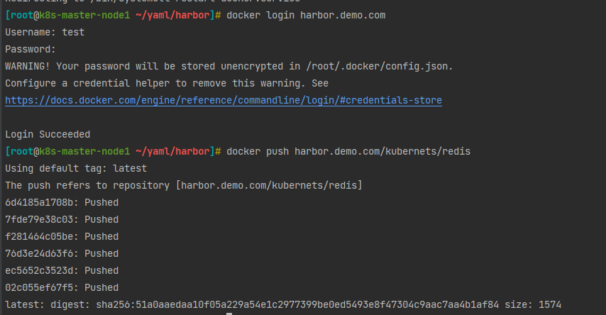
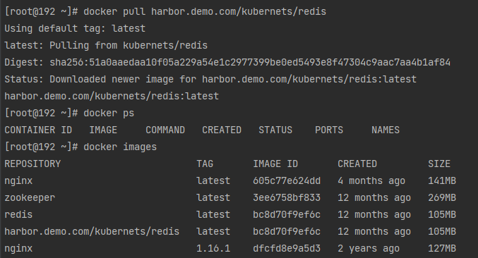
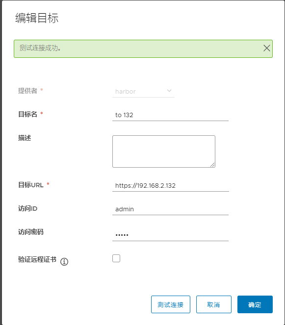
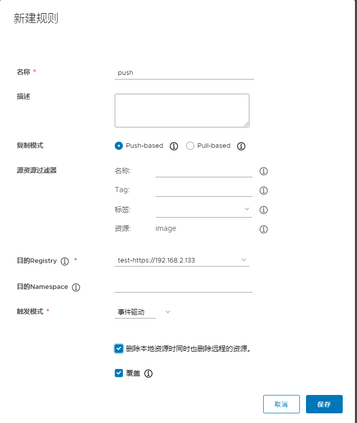

# 1. 安装 harbor

https://github.com/goharbor/harbor 下载离线安装包

将下载好的 harbor 复制到对应的服务器

    tar -vxzf harbor-offline-install.tar.gz

# 1.1 配置证书

```shell
# 生成 CA 证书私钥
openssl genrsa -out ca.key 4096

# 生成 CA 证书
openssl req -x509 -new -nodes -sha512 -days 3650 \
 -subj "/C=CN/ST=Beijing/L=Beijing/O=example/OU=Personal/CN=${domain_url}" \
 -key ca.key \
 -out ca.crt
 
# 生成 CA 证书私钥
openssl genrsa -out ${domain_url}.key 4096

openssl req -sha512 -new \
    -subj "/C=CN/ST=Beijing/L=Beijing/O=example/OU=Personal/CN=${domain_url}" \
    -key ${domain_url}.key \
    -out ${domain_url}.csr
# ip 地址修改
cat > v3.ext <<-EOF
authorityKeyIdentifier=keyid,issuer
basicConstraints=CA:FALSE
keyUsage = digitalSignature, nonRepudiation, keyEncipherment, dataEncipherment
extendedKeyUsage = serverAuth
subjectAltName = IP:${domain_url}
EOF

# domain 
openssl x509 -req -sha512 -days 3650 \
    -extfile v3.ext \
    -CA ca.crt -CAkey ca.key -CAcreateserial \
    -in  ${domain_url}.csr \
    -out ${domain_url}.crt


# 将服务器证书和密钥复制到 Harbor 主机上的 certficates 文件夹中。
mkdir -p /data/cert
cp ${domain_url}.crt  /data/cert/
cp ${domain_url}.key /data/cert/

# Docker 守护进程将.crt文件解释为 CA 证书，将.cert文件解释为客户端证书。
openssl x509 -inform PEM -in ${domain_url}.crt -out ${domain_url}.cert

mkdir -p /etc/docker/certs.d/${domain_url}/
cp ${domain_url}.cert /etc/docker/certs.d/${domain_url}/
cp ${domain_url}.key /etc/docker/certs.d/${domain_url}/
cp ca.crt /etc/docker/certs.d/${domain_url}/

systemctl restart docker
```

直接使用脚本,ip 本机机器
    
    sh init.sh 192.168.2.132

## 1.2 启动

修改 harbor.yml,主要是 修改 ip 地址

```yaml
# 修改
hostname: 192.168.2.132

# http related config
http:
  # port for http, default is 80. If https enabled, this port will redirect to https port
  port: 80
# 修改
# https related config
https:
  # https port for harbor, default is 443
  port: 443
  # The path of cert and key files for nginx
  certificate: /data/cert/192.168.2.132.crt
  private_key: /data/cert/192.168.2.132.key

external_url: https:192.168.2.132
# 修改
harbor_admin_password: admin
```

启动
    
    sh install.sh

## 1.3 访问 nodeIp 直接访问

admin admin 



推送镜像

```shell
echo "192.168.2.132 harbor.demo.com" >> /etc/hosts

docker tag redis harbor.demo.com/kubernets/redis

# 修改 docker http 访问
vi /etc/docker/daemon.json 
{
  "insecure-registries":["harbor.demo.com"]
}
service docker restart
```

创建用户



创建项目并添加管理员



```shell
docker login harbor.demo.com
docker push harbor.demo.com/kubernets/redis
```



## 1.4 另外一台服务下载镜像

```shell
echo "192.168.2.132 harbor.demo.com" >> /etc/hosts

docker tag redis harbor.demo.com/kubernets/redis

# 修改 docker http 访问
vi /etc/docker/daemon.json 
{
  "insecure-registries":["harbor.demo.com"]
}
service docker restart

docker login harbor.demo.com

docker pull harbor.demo.com/kubernets/redis
```


## 1.5 两个仓库互相同步

仓库管理、新建目标



复制管理：采取主动推的方式

